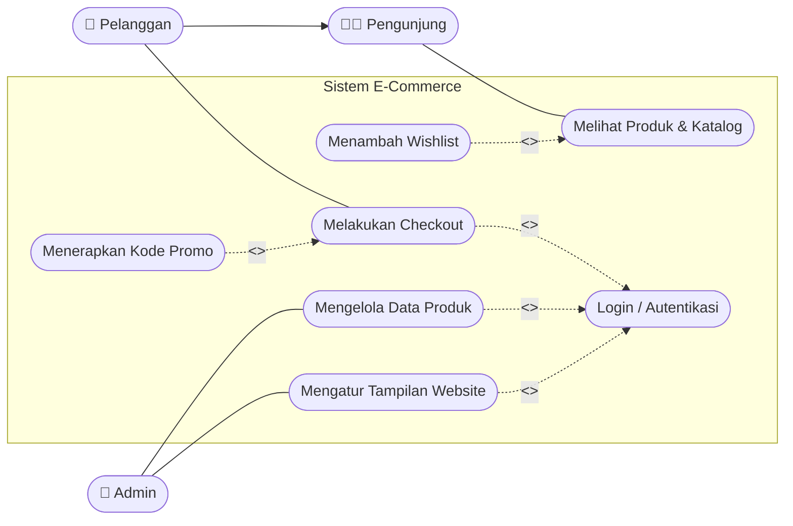
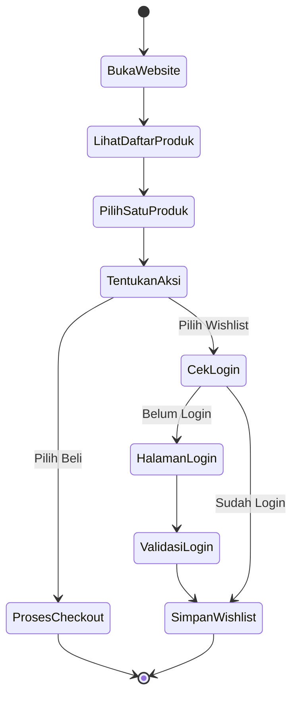
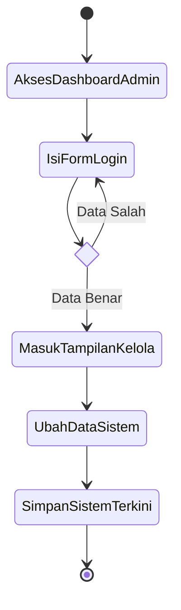
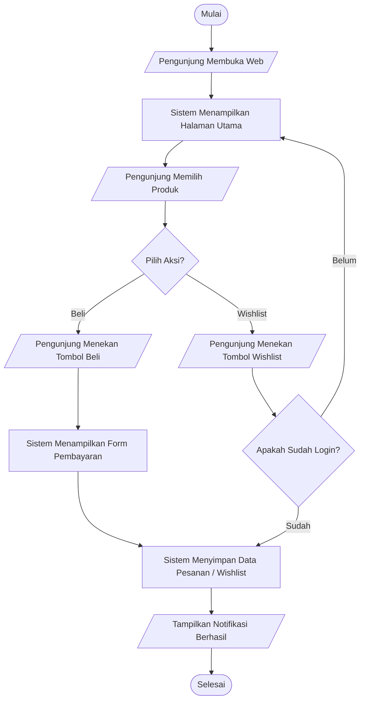
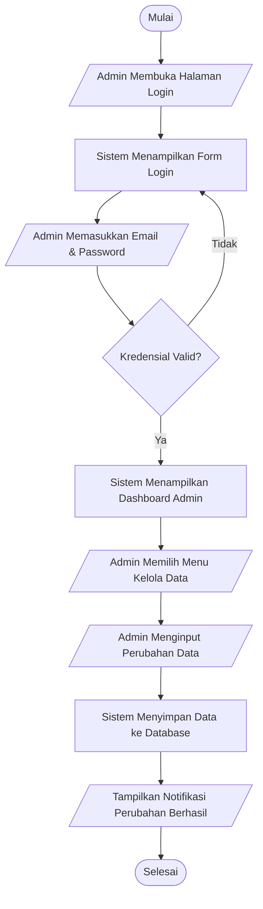

# Diagram Sistem E-Commerce

Berdasarkan standar notasi sistem yang diberikan, berikut adalah 3 jenis diagram (Use Case, Activity, dan Flowchart) untuk menggambarkan rancangan sistem E-Commerce ini.

## 1. Use Case Diagram
Diagram ini memetakan Aktor dan fungsionalitas sistem. Relasi antar Use Case telah disesuaikan agar memuat ke-6 notasi standar secara lengkap: **Aktor**, **Use Case**, **Asosiasi**, **Generalisasi**, **Extend**, dan **Include**.

---

## 2. Activity Diagram
Activity Diagram menggambarkan urutan aktivitas di dalam sistem dari Titik Awal hingga Titik Akhir, lengkap dengan Opsi mengambil keputusan.

### a. Aktivitas Pengguna (Pemesanan & Wishlist)

### b. Aktivitas Admin (Kelola Sistem)

---

## 3. Flowchart
Flowchart menggambarkan alur berjalannya suatu program secara detail, menggunakan notasi *Terminator*, *Input/Output*, *Process*, dan *Decision*.

### Alur Utama Pengunjung Website

### Alur Admin Mengelola Sistem

