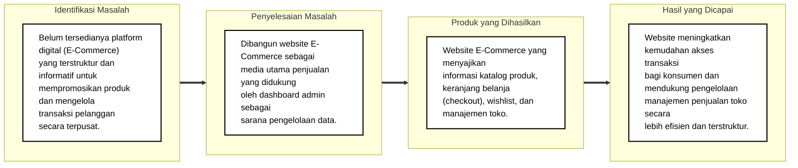

# Kerangka Pikir Sistem E-Commerce

Berdasarkan contoh dan alur gambar yang Anda berikan, berikut adalah rancangan Kerangka Pikir yang telah disesuaikan dengan konteks **Sistem E-Commerce** yang sedang kita buat.

## 1. Uraian Kerangka Pikir

Penjualan produk di era modern membutuhkan media yang dapat menjangkau pelanggan secara luas dan mudah diakses kapan saja. Di era teknologi digital saat ini, Website *E-Commerce* menjadi salah satu media yang paling efektif untuk mempromosikan dan menjual produk secara cepat, aman, dan menarik.

Saat ini, **[Masukkan Nama Toko / Usaha Anda]** belum memiliki platform media *online* mandiri yang memadai untuk memasarkan produk sekaligus memberikan pengalaman belanja yang praktis bagi pelanggannya. Oleh karena itu, diperlukan Perancangan Website *E-Commerce* yang dapat menampilkan informasi lengkap terkait katalog produk, detail harga, serta memfasilitasi proses transaksi (*checkout*) dengan baik.

Dengan adanya Website *E-Commerce* ini, diharapkan jangkauan pemasaran dan upaya pengelolaan penjualan dapat dilakukan secara berkelanjutan, terstruktur, serta mudah dijangkau oleh masyarakat umum (konsumen) dari mana saja. Perancangan ini berfokus pada pengembangan Website *E-Commerce* tersebut serta menilai fungsionalitas dan tanggapan pengguna terhadap hasilnya.

---

## 2. Diagram Kerangka Pikir

Berikut adalah representasi visual diagram kerangka pikir *(Identifikasi Masalah -> Penyelesaian Masalah -> Produk -> Hasil)* sesuai dengan format gambar yang diberikan:

> **Catatan:** Jangan lupa mengubah teks **`[Masukkan Nama Toko / Usaha Anda]`** pada Paragraf kedua dengan nama studi kasus atau tempat penelitian Anda sebenarnya.
